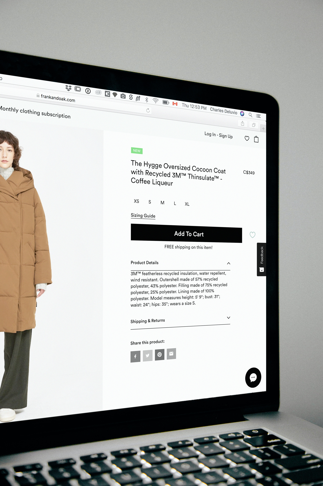

First question that might come to your mind is **Why use analytics?**

Once you have your website live, you may want to have some insights like how may people visit your website ? or which is my most viewed content ? Demographics and much more.

Analytics will also let you identify whether a user faced any error on your website on a particular action. This will help you update your app or website for better experience and conversions and understanding your customer.

**Google Analytics** provides a way to collect this data.  
The platform is free for 10 million hits per month per tracking ID.

## Overview of Google Analytics

Google analytics is platform that collects data and compiles it into useful reports

### How it works ?

- First, you need to create a Google Analytics account
- Add a small piece of javascript tracking code to each page of your site
- Everytime a user visits your website, this tracking code will capture anonymous information about the user behaviour (like, till which step user reached for buying a product or did they actually completed transaction)
- It will also capture user's device information, language, location and what is the source which led the user to come to your website

Photo by <a href="https://unsplash.com/@charlesdeluvio?utm_source=unsplash&amp;utm_medium=referral&amp;utm_content=creditCopyText">Charles Deluvio</a> on <a href="https://unsplash.com/s/photos/ecommerce-website?utm_source=unsplash&amp;utm_medium=referral&amp;utm_content=creditCopyText">Unsplash</a>

> Everytime a page loads, the tracking code will collect and send updated information about the user's activity.

Google Analytics groups this acitivity into a period of time called a "session". A session begins when a user navigates to a page which has google analytics tracking code.
A session ends after 30 minutes of inactivity and a new session begins when the user returns.

### Processing and reporting

While send the data the tracking code packages that information for the google analytics to process it. When anaytics processes data, it aggregates and organizes the data based on particular criteria like user's device, or which browser they're using.

There are also configuration settings that allow you to customize how that data is processed.

> Once Analytics process the data, it's stored in a database where it can't be changed.

## Setting up Google Analytics

### Creating an account

Google analytics requires creating a Google Analytics account. An account has [properties](https://support.google.com/analytics/answer/2649554) that represent invidual collections of data. For example, an account might represent an Organization and one of the properties in that account might represent the organization's website while other might represent the iOS app.

To set up a Google analytics account go [here](http://analytics.google.com).

> Note: The Google Analytics UI is subject to updates and may not look exactly like the screenshots presented here

If you don’t have an account, you can create one by clicking the link for "Create Account."
Proceed by signing up.

### Account set up

Once you have signed in, you will be presented with an account creation screen.

### What do you want to measure ?

Google analytics will ask you next whether you want to measure a website, a mobile app, or both.
Select the desired option and click next.

### Property setup

You can set up your property by entering your website details. You can also select your industry category. This helps Google Analytics build better reports and education that are tailored for your industry.
